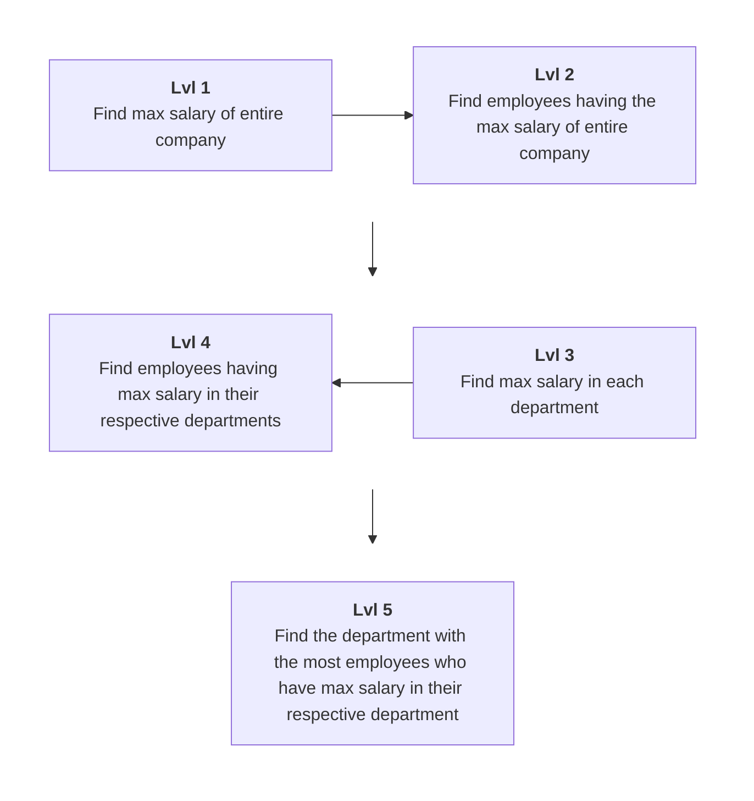

### 1. Employees Questions Progression




??? "Employees table"
    
    | emp_id | name    | salary | department  |
    |--------|---------|--------|-------------|
    | 101    | Aarav   | 120000 | Engineering |
    | 102    | Vivaan  | 135000 | Engineering |
    | 103    | Aditya  | 135000 | Engineering |
    | 104    | Krish   | 98000  | Engineering |
    | 105    | Ishaan  | 110000 | Engineering |
    | 106    | Reyansh | 87000  | Engineering |
    | 201    | Ananya  | 142000 | Data Science |
    | 202    | Diya    | 125000 | Data Science |
    | 203    | Myra    | 142000 | Data Science |
    | 204    | Sara    | 99000  | Data Science |
    | 205    | Riya    | 115000 | Data Science |
    | 301    | Sneha   | 75000  | HR          |
    | 302    | Kavya   | 82000  | HR          |
    | 303    | Priya   | 82000  | HR          |
    | 304    | Tanvi   | 68000  | HR          |
    | 401    | Arjun   | 150000 | Finance     |
    | 402    | Kabir   | 132000 | Finance     |
    | 403    | Laksh   | 150000 | Finance     |
    | 404    | Dhruv   | 119000 | Finance     |
    | 405    | Ayaan   | 95000  | Finance     |
    | 501    | Meera   | 91000  | Marketing   |
    | 502    | Saanvi  | 105000 | Marketing   |
    | 503    | Kiara   | 105000 | Marketing   |
    | 504    | Navya   | 88000  | Marketing   |
    | 505    | Pari    | 72000  | Marketing   |
    | 601    | Rohan   | 99000  | Sales       |
    | 602    | Yash    | 108000 | Sales       |
    | 603    | Harsh   | 108000 | Sales       |
    | 604    | Kunal   | 93000  | Sales       |
    | 605    | Manav   | 87000  | Sales       |
    | 606    | Dev     | 108000 | Sales       |


Lvl 1: Max salary of entire company

=== "MAX()"

    ```sql
        SELECT MAX(salary) AS max_salary
        FROM employees;
    ```

=== "ORDER BY + LIMIT"

    ```sql
        SELECT salary AS max_salary
        FROM employees
        ORDER BY salary DESC
        LIMIT 1;
    ```

=== "Window function"

    ```sql
        SELECT DISTINCT max_salary
        FROM (
            SELECT MAX(salary) OVER () AS max_salary
            FROM employees
        ) t;
    ```

=== "DENSE_RANK"

    ```sql
        SELECT DISTINCT salary AS max_salary
        FROM (
            SELECT salary,
                   DENSE_RANK() OVER (ORDER BY salary DESC) AS rnk
            FROM employees
        ) t
        WHERE rnk = 1;
    ```

=== "NOT EXISTS (self join)"

    ```sql
        SELECT DISTINCT e1.salary AS max_salary
        FROM employees e1
        WHERE NOT EXISTS (
            SELECT 1
            FROM employees e2
            WHERE e2.salary > e1.salary
        );
    ```

=== ">= ALL"

    ```sql
        SELECT DISTINCT salary AS max_salary
        FROM employees
        WHERE salary >= ALL (SELECT salary FROM employees);
    ```

Lvl 2: Employees having the company-wide max salary

=== "Scalar subquery"
    
    ```sql
        SELECT *
        FROM employees
        WHERE salary = (SELECT MAX(salary) FROM employees);
    ```

=== "JOIN on subquery"

    ```sql
        SELECT e.*
        FROM employees e
        JOIN (SELECT MAX(salary) AS max_sal FROM employees) m
          ON e.salary = m.max_sal;
    ```

=== "CTE"

    ```sql
        WITH mx AS (
            SELECT MAX(salary) AS max_sal FROM employees
        )
        SELECT e.*
        FROM employees e
        JOIN mx ON e.salary = mx.max_sal;
    ```

=== "RANK / DENSE_RANK"

    ```sql
        SELECT emp_id, name, salary, department
        FROM (
            SELECT *,
                   RANK() OVER (ORDER BY salary DESC) AS rnk
            FROM employees
        ) t
        WHERE rnk = 1;
    ```

=== "MAX() OVER"

    ```sql
        SELECT emp_id, name, salary, department
        FROM (
            SELECT *,
                   MAX(salary) OVER () AS max_sal
            FROM employees
        ) t
        WHERE salary = max_sal;
    ```

=== "NOT EXISTS"

    ```sql
        SELECT *
        FROM employees e1
        WHERE NOT EXISTS (
            SELECT 1
            FROM employees e2
            WHERE e2.salary > e1.salary
        );
    ```

=== ">= ALL"

    ```sql
        SELECT *
        FROM employees
        WHERE salary >= ALL (SELECT salary FROM employees);
    ```

Lvl 3: Max salary in each department

=== "GROUP BY"

    ```sql
        SELECT department, MAX(salary) AS max_salary
        FROM employees
        GROUP BY department;
    ```

=== "Window function"

    ```sql
        SELECT DISTINCT department,
               MAX(salary) OVER (PARTITION BY department) AS max_salary
        FROM employees;
    ```

=== "DENSE_RANK"

    ```sql
        SELECT DISTINCT department, salary AS max_salary
        FROM (
            SELECT department, salary,
                   DENSE_RANK() OVER (PARTITION BY department ORDER BY salary DESC) AS rnk
            FROM employees
        ) t
        WHERE rnk = 1;
    ```

=== "Correlated subquery"

    ```sql
        SELECT DISTINCT e1.department, e1.salary AS max_salary
        FROM employees e1
        WHERE e1.salary = (
            SELECT MAX(e2.salary)
            FROM employees e2
            WHERE e2.department = e1.department
        );
    ```

=== "NOT EXISTS"

    ```sql
        SELECT DISTINCT e1.department, e1.salary AS max_salary
        FROM employees e1
        WHERE NOT EXISTS (
            SELECT 1
            FROM employees e2
            WHERE e2.department = e1.department
              AND e2.salary > e1.salary
        );
    ```

Lvl 4: Employees having the max salary in their department

=== "Correlated subquery"

    ```sql
        SELECT *
        FROM employees e1
        WHERE salary = (
            SELECT MAX(salary)
            FROM employees e2
            WHERE e2.department = e1.department
        );
    ```

=== "JOIN on GROUP BY"

    ```sql
        SELECT e.*
        FROM employees e
        JOIN (
            SELECT department, MAX(salary) AS max_sal
            FROM employees
            GROUP BY department
        ) m
          ON e.department = m.department
         AND e.salary = m.max_sal;
    ```

=== "IN (tuple)"
    
    ```sql
        SELECT *
        FROM employees
        WHERE (department, salary) IN (
            SELECT department, MAX(salary)
            FROM employees
            GROUP BY department
        );
    ```

=== "CTE"

    ```sql
        WITH dept_max AS (
            SELECT department, MAX(salary) AS max_sal
            FROM employees
            GROUP BY department
        )
        SELECT e.*
        FROM employees e
        JOIN dept_max d
          ON e.department = d.department
         AND e.salary = d.max_sal;
    ```

=== "RANK / DENSE_RANK"

    ```sql
        SELECT emp_id, name, salary, department
        FROM (
            SELECT *,
                   RANK() OVER (PARTITION BY department ORDER BY salary DESC) AS rnk
            FROM employees
        ) t
        WHERE rnk = 1;
    ```

=== "MAX() OVER"

    ```sql
        SELECT emp_id, name, salary, department
        FROM (
            SELECT *,
                   MAX(salary) OVER (PARTITION BY department) AS max_sal
            FROM employees
        ) t
        WHERE salary = max_sal;
    ```

=== "NOT EXISTS"

    ```sql
        SELECT *
        FROM employees e1
        WHERE NOT EXISTS (
            SELECT 1
            FROM employees e2
            WHERE e2.department = e1.department
              AND e2.salary > e1.salary
        );
    ```

Lvl 5: Department with the most employees at their department's max salary

=== "CTE + ORDER BY LIMIT"

    ```sql
        WITH top_earners AS (
            SELECT *,
                   RANK() OVER (PARTITION BY department ORDER BY salary DESC) AS rnk
            FROM employees
        )
        SELECT department, COUNT(*) AS top_earner_count
        FROM top_earners
        WHERE rnk = 1
        GROUP BY department
        ORDER BY top_earner_count DESC
        LIMIT 1;
    ```

=== "Join + GROUP BY"

    ```sql
        SELECT e.department, COUNT(*) AS top_earner_count
        FROM employees e
        JOIN (
            SELECT department, MAX(salary) AS max_sal
            FROM employees
            GROUP BY department
        ) m
          ON e.department = m.department
         AND e.salary = m.max_sal
        GROUP BY e.department
        ORDER BY top_earner_count DESC
        LIMIT 1;
    ```

=== "HAVING = MAX (handles ties)"

    ```sql
        WITH counts AS (
            SELECT e.department, COUNT(*) AS cnt
            FROM employees e
            WHERE e.salary = (
                SELECT MAX(salary)
                FROM employees
                WHERE department = e.department
            )
            GROUP BY e.department
        )
        SELECT department, cnt AS top_earner_count
        FROM counts
        WHERE cnt = (SELECT MAX(cnt) FROM counts);
    ```

=== "RANK on counts (handles ties)"
