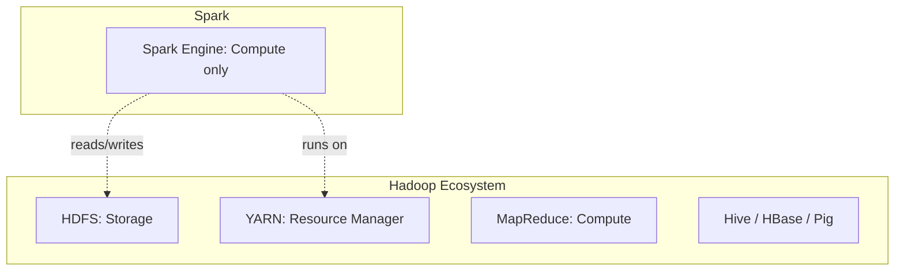
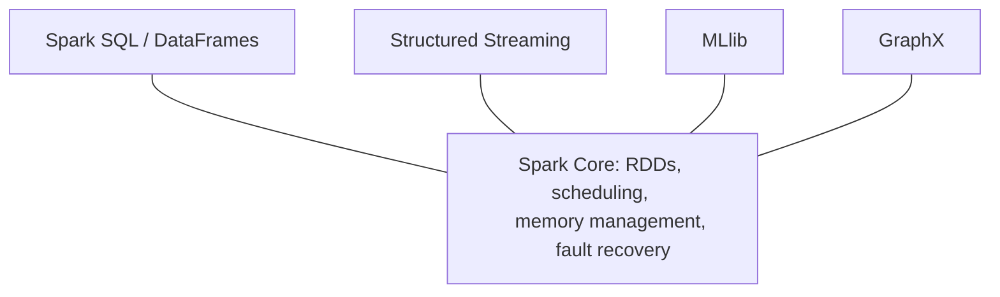

## 1. What is Spark?

**Apache Spark** is an open-source, distributed **computing engine**
for **parallel processing of large-scale data**. 

It splits data into partitions, spreads the work across a cluster of 
machines, and processes the partitions at the same time,
mostly **in memory**.

- Handles **batch** and **streaming** workloads
- Supports Python (PySpark), Scala, Java, R, and SQL
- Does **not** store data itself.
- Can connect to various sources where data is stored
like AWS, JDBS, MYSQL etc.

---

## 2. Hadoop vs Spark

| S. No.                | Hadoop MapReduce                                                                           | Spark                                                                                                    |
|-----------------------|--------------------------------------------------------------------------------------------|----------------------------------------------------------------------------------------------------------|
| 1. Main difference    | Every stage **reads from disk and writes back to disk** (HDFS)                             | **Intermediate** data stays **in memory (RAM)** across stages. Only final results are write to disk. |
| 2. Disk I/O           | Disk I/O is the main bottleneck.                                                           | Disk is touched mainly at the start (read) and end (write)                                               |
| 3. Fault Tolerance    | Strong, since every stage is persisted.    Handled by Replication and disk persistence | Also good, handled by Lineage (recompute lost partitions instead of being persisted at every step)                                               |
| 4. Best Suited        | very large, one-pass batch jobs.                                                           | Ideal for iterative and multi-stage workloads                                                            |
| 5.   Speed            | Slower | Up to ~100x faster in memory, ~10x on disk |

**Ecosystem vs Computing Engine**

|                        | Hadoop                                                                                   | Spark                                       |
|------------------------|------------------------------------------------------------------------------------------|---------------------------------------------|
| 6. Type                | Ecosystem (framework of components like  storage + resource management + compute + tools) | Computing engine. It plugs into other  pieces for storage and cluster management.                          |
| 7. Storage             | HDFS (built in)                                                                          | None, uses HDFS, S3, ADLS, GCS, etc.        |
| 8. Resource management | YARN (built in)                                                                          | Uses YARN, Kubernetes, Mesos, or Standalone |
| 9. Compute             | MapReduce                                                                                | Spark Core engine                           |
| 10. Related tools      | Hive, HBase, Pig, Oozie                                                                  | Spark SQL, MLlib, Streaming, GraphX         |

!!! note
    Spark and Hadoop are **not strict rivals**. Spark commonly 
    runs **on top of** Hadoop, replacing MapReduce as the compute layer while using HDFS and YARN.

---

## 3. Who Created Spark?

- Created by **Matei Zaharia** at **UC Berkeley's AMPLab** in **2009**.
- Donated to the **Apache Software Foundation** in **2013**.
- Aim: To overcome MapReduce's slowness on **iterative** and **interactive** workloads.

---

## 4. Components of Spark

| Component | Purpose |
|---|---|
| **Spark Core** | Foundation: task scheduling, memory management, fault recovery, RDD API |
| **Spark SQL** | Structured data processing with SQL and DataFrames |
| **Spark Streaming / Structured Streaming** | Real-time and near-real-time stream processing |
| **MLlib** | Distributed machine learning library |
| **GraphX** | Graph processing and graph-parallel computation |

!!! Note
    Everything sits **on top of Spark Core**, which handles the distributed execution.