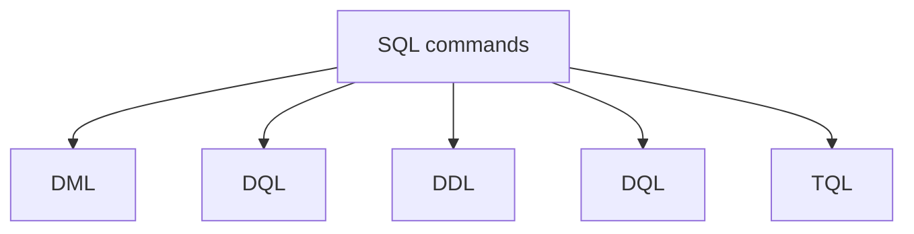

# NULL Semantics in SQL

SQL follows 3-valued logic:

- TRUE
- UNKNOWN
- FALSE

## Some Logical Operations

::box
NOT UNKNOWN = UNKNOWN
UNKNOWN AND UNKNOWN = UNKNOWN
--- OR --- = ---
::

::box 
TRUE AND UNKNOWN = UNKNOWN
TRUE OR UNKNOWN = <Red>TRUE</Red>
::


## 1. NULL in WHERE

WHERE `only filters` rows that are 'TRUE'.

::box 
```sql
---
```
::

::box 
Improvement:
%sql
- - -
::


### **Laptop vs. Desktop**

| Feature | Laptop | Desktop |
| :--- | :--- | :--- |
| **Portability** | Highly portable and easy to carry. | Heavy and designed for a fixed location. |
| **Power Source** | Runs on a rechargeable internal battery. | Requires a constant wall outlet connection. |
| **Upgradability** | Limited to RAM and storage upgrades. | Highly customizable with easily swappable parts. |
| **Cost Efficiency** | More expensive for equivalent performance. | Offers higher performance per dollar spent. |


# single likhenge to poora ayega 
::box 
FALSE AND UNKNOWN = <Red>FALSE</Red>
FALSE OR UNKNOWN = UNKNOWN
::

## Flow chart

::box



::